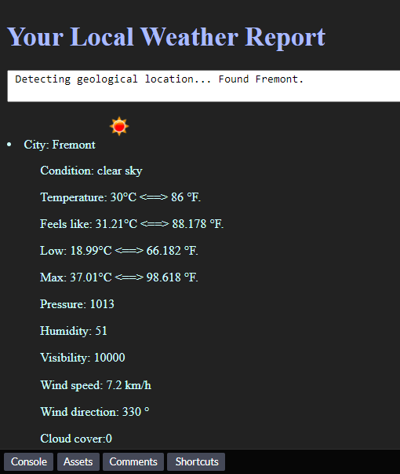

# LocalWeather
Use geolocation to get current position in longitude and latitude.  Then query for weather statistics given the lng-lat value.

## Bootstrap express to existing code

Create a folder for your project and initialize it as Node project, `npm init -y`. Create the server file, app.js `touch app.js`, and other directories `mkdir views`.

Let's install express to configure a lightweight Node server.

`npm i express` or `yarn add express`.

## Runtime

`npm start`

<strong>Output</strong>

